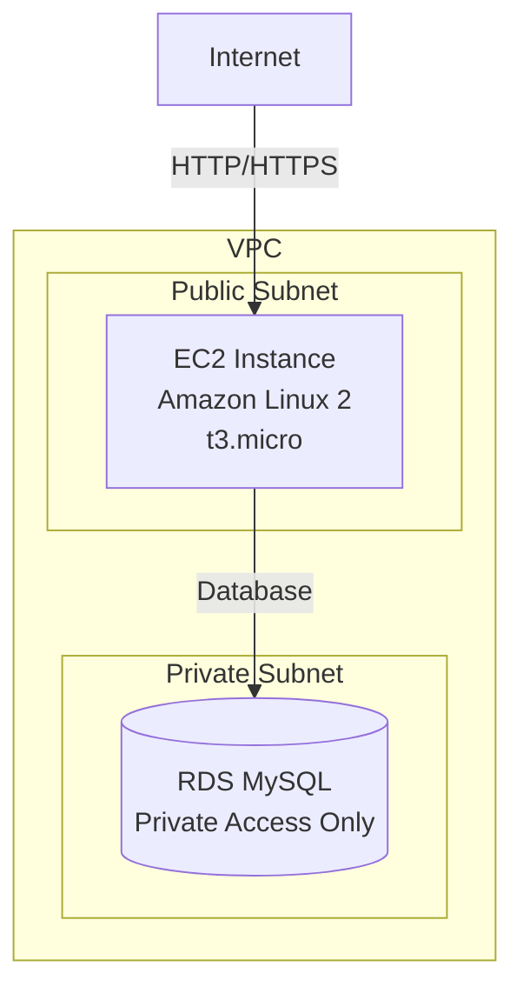

# 3-tier-architecture-aws

VPC with 1 EC2 instance and RDS database, provisioned via Terraform.

## Services
- **1 EC2 Instance**: Public subnet (HTTPS/HTTP access)
- **1 RDS Instance**: Private subnet (MySQL/PostgreSQL)
- **VPC**: With 6 subnets and NACLs

